# Remoção do Menu Músicas e Centralização no Pedido

**Data:** Fevereiro 2025  
**Plano de referência:** `remover_menu_músicas_e_centralizar_no_pedido_4952d167.plan.md`

---

## Visão Geral

Este documento descreve as alterações implementadas para:

1. **Remover o menu "Músicas"** do painel administrativo, centralizando o acesso às músicas nos detalhes do pedido
2. **Ajustar o fluxo do cliente** para persistir dados assim que o botão "Gerar letra" é clicado e salvar a letra gerada imediatamente no quiz

---

## Parte 1: Remoção do Menu e Rotas de Músicas

### 1.1 O que foi removido

| Item | Status |
|------|--------|
| Item "Músicas" no AdminSidebar | ✅ Removido |
| Rotas `/admin/songs` e `/admin/songs/:id` | ✅ Removidas (AdminRoutes e AppRoutes) |
| Páginas AdminSongs.tsx e AdminSongDetails.tsx | ✅ Arquivos removidos |
| Permissão "songs" em colaboradores | ✅ Removida de todos os pontos |

### 1.2 Onde acessar músicas agora

- **Dashboard:** A aba "Músicas" continua no Dashboard, exibindo músicas recentes. Cada item é **clicável** e navega para `/admin/orders/:orderId` (detalhe do pedido).
- **Pedidos:** Todas as músicas, letras e jobs do pedido estão em **AdminOrderDetails** (`/admin/orders/:id`).

### 1.3 Arquivos alterados

| Arquivo | Alteração |
|---------|-----------|
| `AdminSidebar.tsx` | Item "Músicas" removido do menu |
| `AdminRoutes.tsx` | Rotas songs removidas |
| `AppRoutes.tsx` | Rotas songs removidas |
| `AdminDashboardRedirect.tsx` | Referências a `songs` removidas de `permissionsMap` e `allowedRoutes` |
| `useCollaboratorPermissions.ts` | `songs` removido de `defaultCollaboratorPermissions` e `allowedRoutes` |
| `AdminUserCard.tsx` | Permissão "Músicas" removida de `ALL_PERMISSIONS` |
| `AdminCollaborators.tsx` | Textos atualizados (removido "Músicas") |
| `AdminSettings.tsx` | Textos atualizados (removido "Músicas") |
| `AdminDashboard.tsx` | Músicas recentes passam a ser clicáveis e navegam para o pedido |

---

## Parte 2: Fluxo do Cliente – Persistência ao Gerar Letra

### 2.1 Novo fluxo implementado

```
Cliente preenche formulário
    → Clica "Gerar letra"
    → persistQuiz() é chamado (se quizId ainda não existir)
    → Quiz salvo no banco
    → handleGenerateLyrics() chama API
    → API retorna letra
    → Letra salva imediatamente em quiz.answers (generated_lyrics, generated_lyrics_title, generated_lyrics_at)
    → Letra exibida para aprovação
    → Usuário aprova
    → handleGoToPayment() atualiza approved_lyrics (mesclando com answers existentes)
    → Checkout e pagamento
```

### 2.2 Campos em `quiz.answers`

| Campo | Quando é preenchido | Descrição |
|-------|---------------------|-----------|
| `generated_lyrics` | Ao receber letra da API | Texto da letra gerada (rascunho) |
| `generated_lyrics_title` | Ao receber letra da API | Título da letra gerada |
| `generated_lyrics_at` | Ao receber letra da API | Timestamp da geração |
| `approved_lyrics` | Ao clicar "Aprovar" | Letra aprovada pelo cliente |
| `approved_lyrics_title` | Ao clicar "Aprovar" | Título aprovado |
| `approved_lyrics_at` | Ao clicar "Aprovar" | Timestamp da aprovação |

### 2.3 Garantias implementadas

1. **persistQuiz antes de gerar:** Se `handleGenerateLyrics` for chamado sem `quizId` (ex.: acesso direto ao step 2), `persistQuiz()` é chamado antes da API.
2. **Salvar letra imediatamente:** Após receber a letra da API, o quiz é atualizado no banco e no localStorage com `generated_lyrics`.
3. **Merge em handleGoToPayment:** Ao aprovar, `approved_lyrics` é mesclado com os `answers` existentes, evitando perda de `generated_lyrics`, `customer_name`, etc.

### 2.4 Arquivos alterados

| Arquivo | Alteração |
|---------|-----------|
| `QuizCheckoutFlow.tsx` | `handleGenerateLyrics`: chamada a `persistQuiz` se não houver `quizId`; salvamento de `generated_lyrics` no quiz após receber da API |
| `QuizCheckoutFlow.tsx` | `handleGoToPayment`: merge de `answers` existentes ao atualizar `approved_lyrics` |

---

## Diagrama do Fluxo

```mermaid
flowchart TD
    subgraph Cliente [Fluxo Cliente]
        A[Preenche formulário] --> B[Clica Gerar letra]
        B --> C[persistQuiz - salva quiz no DB]
        C --> D[handleGenerateLyrics - chama API]
        D --> E[API retorna letra]
        E --> F[Salva letra no quiz imediatamente]
        F --> G[Exibe letra para aprovação]
        G --> H[Usuário aprova]
        H --> I[handleGoToPayment - atualiza approved_lyrics]
        I --> J[Checkout e pagamento]
    end
    
    subgraph Admin [Admin]
        K[Pedidos] --> L[Detalhe do pedido]
        L --> M[Quiz + Letras + Jobs + Músicas]
    end
```



---

## Pontos Resolvidos do Plano Original

| Ponto | Decisão |
|-------|---------|
| AdminGenerate (`/admin/generate`) | **Mantido** – usado para gerar letras manualmente por order ID |
| Schema do quiz | **Usar `generated_lyrics`** em `answers` para rascunho; `approved_lyrics` para aprovação |
| AdminSongs e AdminSongDetails | **Removidos** – músicas acessíveis apenas via Order Details |

---

## Melhorias Futuras (Opcionais)

1. **AdminOrderDetails – exibir letras do quiz:** O quiz é buscado sem o campo `answers`. Para mostrar `generated_lyrics` ou `approved_lyrics` quando o cliente ainda não aprovou, seria necessário:
   - Incluir `answers` no `select` do quiz
   - Adicionar seção para exibir `quiz.answers?.generated_lyrics` ou `quiz.answers?.approved_lyrics`

2. **Limpeza de permissões antigas:** Colaboradores que tinham `permission_key='songs'` na tabela `collaborator_permissions` podem manter registros obsoletos. Uma migração opcional pode remover ou migrar esses registros.

---

## Resumo

- Menu "Músicas" removido; acesso centralizado em **Pedidos → Detalhe do pedido**.
- Fluxo do cliente ajustado para persistir quiz e letra gerada assim que a API retorna.
- AdminGenerate mantido para geração manual de letras.
- Build e testes passando.
